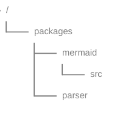

# Indigo Engine

Custom 2D/3D game engine written in C++ and Vulkan.

## Overview
This project is a custom game engine written in C++ using Vulkan.  
The goal is to build a clean, modular architecture for rendering, input, and resource management.  

The engine will be used as a foundation for future game projects.

## Goals

- Clean and simple architecture
- Vulkan-based rendering
- Separation of data and rendering logic
- Expandable for future features

## Project Structure



```
Main
 ├── System
 │    ├── Graphics
 │    │    ├── Vulkan
 │    │    ├── Texture
 │    │    ├── Bitmap
 │    │    │    └── BitmapRenderer
 │    │    ├── Font
 │    │    │    └── Text
 │    │    │         └── TextRenderer
 │    │    └── Renderer
 │    └── Input
 ├── ErrorDialog
 └── Global
```

## Build

Requirements:
- CMake
- Vulkan SDK
- C++ compiler (GCC/Clang)

Build steps:

```bash
mkdir build
cd build
cmake ..
make
```

## Status
Work in progress.
